## Packages  


```r
library(datasets)
library(splines)
library(rjags)
library(ggplot2)
library(dplyr)
library(tidyr)

# install.packages("jagam")  
# But jagam is not available any more
# - This would have been a possibility - dynamically it picks spline knots 
# - https://stat.ethz.ch/R-manual/R-devel/library/mgcv/html/jagam.html

data(mtcars)
```


## Models for uncensored data  

### Linear model with JAGS   

Code from https://stackoverflow.com/questions/34989790/how-to-add-a-spline-to-rjags-model  


```r
# Specify a JAGS linear model

mk_jags_lin_mod <- function(prior.a, prior.b){
  sink(paste("lin_reg_jags.mod.txt", sep=""))
  cat(paste0("model {
  for (i in 1:N){
    y[i] ~ dnorm(y.hat[i], tau)
    y.hat[i] <- a + b * x[i]
    }
  a ~ ",prior.a,
    "\tb ~ ",prior.b,
    "\ttau <- pow(sigma, -2)
  sigma ~ dunif(0, 100)
}"))
sink()
}

# Define a default vague prior
default <- "dnorm(0, .0001)\n"

mk_jags_lin_mod(default, default)

# Initialise
jags.cars <- jags.model('lin_reg_jags.mod.txt',
                        data = list('x' = mtcars$hp,
                                    'y' = mtcars$mpg,
                                    'N' = nrow(mtcars)),
                        n.chains = 2,
                        n.adapt = 1000)
```

```
## Compiling model graph
##    Resolving undeclared variables
##    Allocating nodes
## Graph information:
##    Observed stochastic nodes: 32
##    Unobserved stochastic nodes: 3
##    Total graph size: 118
## 
## Initializing model
```

```r
# Burn-in
update(jags.cars, 5000) 

# Sample
coda.cars <- coda.samples(jags.cars, variable.names = c('a', 'b', 'y.hat','tau'), n.iter = 1000)

# Extract posterior estimates
coda.sum <- summary(coda.cars)
q <- coda.sum$quantiles

mtcars$fit <- tail(q, -3)[,3]
mtcars$lower <- tail(q, -3)[,1]
mtcars$upper <- tail(q, -3)[,5]

ggplot(data=mtcars, aes(x=hp, y=mpg)) + geom_point() +
  geom_line(aes(y=fit, col="red")) +
  geom_line(aes(y = lower), linetype = "dashed") +
  geom_line(aes(y = upper), linetype = "dashed")
```

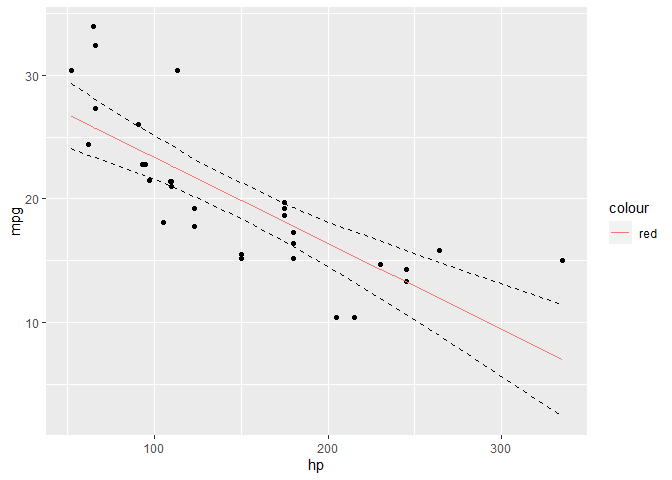<!-- -->

### Splines with JAGS   

Code from https://docs.google.com/document/d/1AaKlgACkanDEqeFkL1EdS81eQdXHhgLTUmj9_PLcmM8/edit# 


```r
# Specify model

mk_jags_spline_mod <- function(prior.a, prior.b){
  sink(paste("spline_reg_jags.mod.txt", sep=""))
  cat(paste0("model {
  
  for (i in 1:N){
    y[i] ~ dnorm(y.hat[i], tau)
    y.hat[i] <- a + beta[1] + beta[2]*x[i] + beta[3]*pow(x[i], 2) + beta[4]*pow(x[i], 3)
  }
  
  a ~ dnorm(0, .0001)
  
  # Specify priors for spline terms
  for (k in 1:4) {
    beta.mu[k] ~ dnorm(0, 100)
    beta.tau[k] ~ dgamma(0.01, 10)
    beta[k] ~ dnorm(beta.mu[k], beta.tau[k])
  }
    tau <- pow(sigma, -2)
    sigma ~ dunif(0, 100)
}"))
sink()
}


# Define a default vague prior
default <- "dnorm(0, .0001)\n"

mk_jags_spline_mod(default, default)

# Initialise
jags.cars <- jags.model('spline_reg_jags.mod.txt',
                        data = list('x' = mtcars$hp,
                                    'y' = mtcars$mpg,
                                    'N' = nrow(mtcars)),
                        n.chains = 2,
                        n.adapt = 1000)
```

```
## Compiling model graph
##    Resolving undeclared variables
##    Allocating nodes
## Graph information:
##    Observed stochastic nodes: 32
##    Unobserved stochastic nodes: 14
##    Total graph size: 220
## 
## Initializing model
```

```r
# Burn-in
update(jags.cars, 5000) 

# Sample
coda.cars <- coda.samples(jags.cars, variable.names = c('a', 'b', 'y.hat','tau'), n.iter = 1000)
```

```
## Warning in FUN(X[[i]], ...): Failed to set trace monitor for b
## Variable b not found
```

```r
# Extract posterior estimates
coda.sum <- summary(coda.cars)
q <- coda.sum$quantiles

mtcars$fit <- tail(q, -2)[,3]
mtcars$lower <- tail(q, -2)[,1]
mtcars$upper <- tail(q, -2)[,5]

ggplot(data=mtcars, aes(x=hp, y=mpg)) + geom_point() +
  geom_line(aes(y=fit, col="red")) +
  geom_line(aes(y = lower), linetype = "dashed") +
  geom_line(aes(y = upper), linetype = "dashed")
```

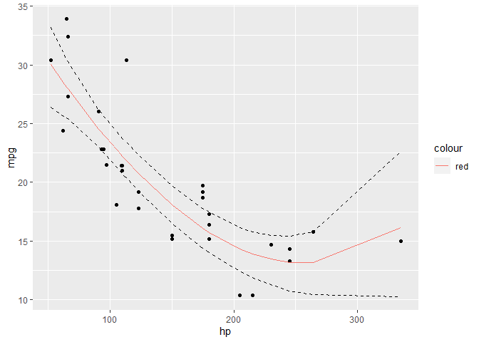<!-- -->


## Simulated data - no sencoring 

### Create data   


```r
X <- seq(from=-1, to=1, by=.025) # generating inputs
B <- t(bs(X, knots=seq(-1,1,1), degree=2, intercept = TRUE)) # creating the B-splines
num_data <- length(X); num_basis <- nrow(B)
a0 <- 0.2 # intercept

set.seed(991)
a <- rnorm(num_basis, 0, 1) # coefficients of B-splines
n_param <- length(a)

Y_true <- as.vector(a0*X + a%*%B) # generating the output
Y <- Y_true + rnorm(length(X),0,.1) # adding noise

dat <- data.frame(x = X, y = Y, y_true = Y_true)
nrow(dat)
```

```
## [1] 81
```


### Show data  


```r
ggplot(dat, aes(x, y)) +
  geom_point() +
  geom_line(aes(y = y_true), color = "blue")
```

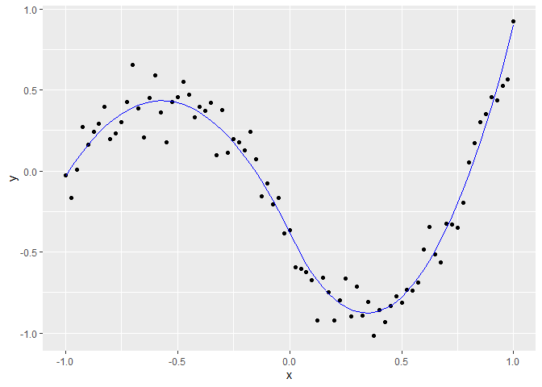<!-- -->

### Estimate model using JAGS  

```r
# Define a default vague prior
default <- "dnorm(0, .0001)\n"

mk_jags_spline_mod(default, default)

# Initialise
jags.sim1 <- jags.model('spline_reg_jags.mod.txt',
                        data = list('x' = dat$x,
                                    'y' = dat$y,
                                    'N' = nrow(dat)),
                        n.chains = 2,
                        n.adapt = 1000)
```

```
## Compiling model graph
##    Resolving undeclared variables
##    Allocating nodes
## Graph information:
##    Observed stochastic nodes: 81
##    Unobserved stochastic nodes: 14
##    Total graph size: 632
## 
## Initializing model
```

```r
# Burn-in
update(jags.sim1, 5000) 

# Sample
coda.sim1 <- coda.samples(jags.sim1, variable.names = c('a', 'b', 'y.hat','tau'), n.iter = 1000)
```

```
## Warning in FUN(X[[i]], ...): Failed to set trace monitor for b
## Variable b not found
```

```r
# Extract posterior estimates
coda.sum <- summary(coda.sim1)
q <- coda.sum$quantiles

dat$jags_fit <- tail(q, -2)[,3]
dat$jags_lower <- tail(q, -2)[,1]
dat$jags_upper <- tail(q, -2)[,5]

ggplot(dat, aes(x, y)) +
  geom_line(aes(y=jags_fit, col="red")) +
  geom_line(aes(y = jags_lower), col="red", linetype = "dashed") +
  geom_line(aes(y = jags_upper), col="red", linetype = "dashed") +
  geom_point() +
  geom_line(aes(y = y_true), color = "blue")
```

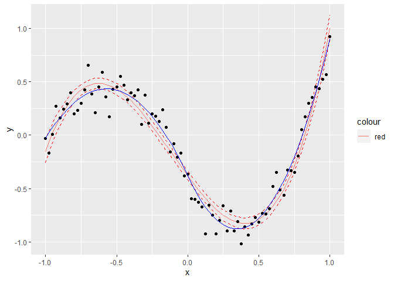<!-- -->

### Same, with smooth.spline and gam  

```r
model_smooth <- smooth.spline(dat$x, dat$y)
check <- model_smooth$x - dat$x
dat$smooth_fit <- model_smooth$y

library(mgcv)
```

```
## Loading required package: nlme
```

```
## 
## Attaching package: 'nlme'
```

```
## The following object is masked from 'package:dplyr':
## 
##     collapse
```

```
## This is mgcv 1.8-38. For overview type 'help("mgcv-package")'.
```

```r
model_gam <- gam(y ~ s(x), data = dat)
dat$gam_fit <- predict(model_gam)


ggplot(dat, aes(x, y)) +
  geom_line(aes(y=jags_fit, col= "red")) +
  geom_line(aes(y=gam_fit, col="green2")) +
  geom_line(aes(y=smooth_fit, col="purple")) +
  geom_point() +
  geom_line(aes(y = y_true), color = "blue")
```

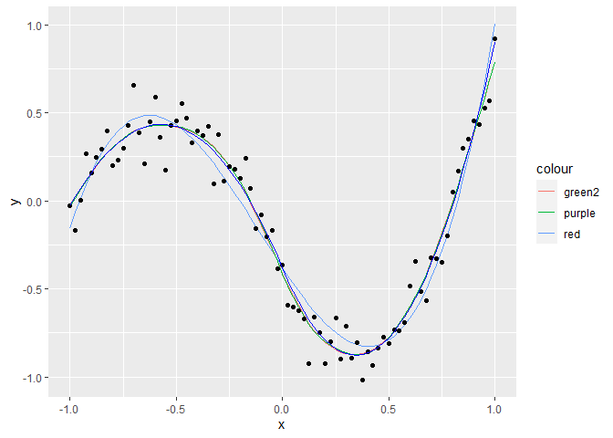<!-- -->

```r
dat_pred <- dat %>%
  pivot_longer(c(jags_fit, gam_fit, smooth_fit, y_true), 
               names_to = "Procedure", values_to = "y_fit") %>%
  mutate(Procedure = factor(Procedure) %>% forcats::fct_relevel("y_true"))

ggplot(dat_pred, aes(x, y_fit, color = Procedure, size = Procedure)) +
  geom_line() +
  scale_size_manual(values = c("gam_fit" = 2, "jags_fit" = 1, "smooth_fit" = 1, "y_true" = 3))
```

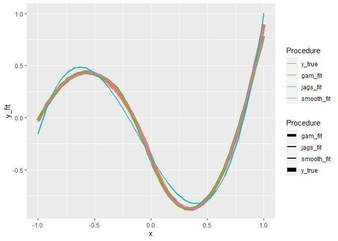<!-- -->


## Censored data - linear    


### Function for linear model   

* From DHJ's package leftcensored   

    - One change: including y_hat specifically


```r
leftcensored_lm <- function(data,
                            n.chains = n.chains, # Number of different starting positions
                            n.iter = n.iter, # Number of iterations
                            n.burnin = n.burnin, # Number of iterations to remove at start
                            n.thin = n.thin){
  
  # Censoring vs truncation:
  # https://stats.stackexchange.com/a/144047/13380 
  # Also see here for an alternative way to set up the model:
  # https://stats.stackexchange.com/questions/6870/censoring-truncation-in-jags
  # NOTE: CHECK THIS for multi-level statistical models:
  # https://stats.stackexchange.com/questions/185254/multi-level-bayesian-hierarchical-regression-using-rjags
  
  # Set all censored data to NA (if not already done)
  # Imortant! Otherwise all LOQ stuff is ignored
  data$y_cens[data$y_aboveLOQ == 0] <- NA
  
  # Jags code to fit the model to the simulated data
  # Jags code to fit the model to the simulated data
  
  model_code = '
model
{
  # Likelihood
  for (i in 1:n) {
    y_aboveLOQ[i] ~ dinterval(y_cens[i], y_LOQ[i])
    y_cens[i] ~ dnorm(y_hat[i], sigma^-2)
    y_hat[i] <- intercept + slope * x[i]
  }

  # Priors
  intercept ~ dnorm(0, 100^-2)
  slope ~ dnorm(0, 100^-2)
  sigma ~ dunif(0, 10)
}
'
  ### Set up data and parameters
  # Set up the data
  model_data <- list(n = nrow(data), 
                    y_cens = data$y_cens, 
                    y_aboveLOQ = data$y_aboveLOQ,
                    y_LOQ = data$y_LOQ,
                    x = data$x)
  
  # Choose the parameters to watch (including y_hat)
  model_parameters <-  c("intercept", "slope", "y_hat", "sigma")
  
  ### Run model
  # Run the model
  model_run <- R2jags::jags(data = model_data,
                   parameters.to.save = model_parameters,
                   model.file=textConnection(model_code),
                   n.chains=4, # Number of different starting positions
                   n.iter = 5000, # Number of iterations
                   n.burnin = 1000, # Number of iterations to remove at start
                   n.thin=2) # Amount of thinning
  
  # model_run
  model_mcmc <- coda::as.mcmc(model_run)
  # summary(model_mcmc) %>% str()
  list(summary = summary(model_mcmc),
       model = model_mcmc)
  
}
```

### Function for getting estimated values (= posterior quantiles of y_hat)


```r
get_estimated_line <- function(jagsresult, data_x_values){
  
  qnt <- jagsresult$summary$quantiles
  
  # Get y hat
  qnt_yhat <- qnt[grepl("y_hat", rownames(qnt)),]
  
  # Sort y hat
  i <- stringr::str_extract(rownames(qnt_yhat), "[0-9]+") %>% as.numeric()
  pred_yhat <- qnt_yhat[order(i),] %>% as.data.frame()
  
  # Add x
  pred_yhat$x <- data_x_values
  
  pred_yhat
  
}
```


### mtcars dataset, censored


```r
thr <- 14

mtcars_cns <- mtcars %>%
  mutate(
    mpg_cns = case_when(
      mpg < thr ~ thr,
      TRUE~ mpg),
    mpg_over = case_when(
      mpg < thr ~ 0,
      TRUE ~ 1),
    thresh = thr
  )
  
ggplot(data=mtcars_cns, 
       aes(x=hp, y=mpg_cns, color = factor(mpg_over))) + 
  geom_point()
```

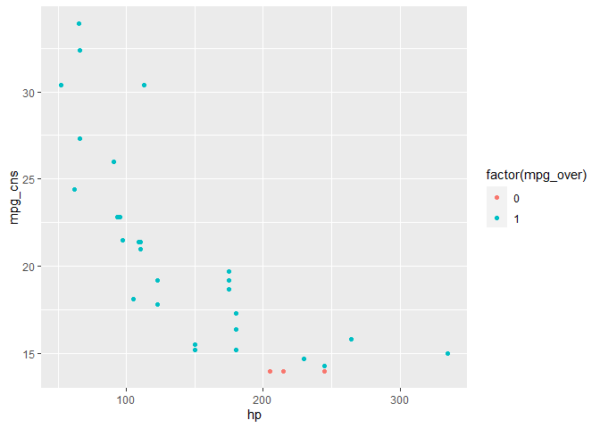<!-- -->

### mtcars, linear model   


```r
# x, y_cens, y_aboveLOQ, y_LOQ

df_test <- mtcars_cns %>%
  rename(
    x = hp,
    y_cens = mpg_cns,
    y_aboveLOQ = mpg_over,
    y_LOQ = thresh)

result <- leftcensored_lm(df_test)
```

```
## module glm loaded
```

```
## Compiling model graph
##    Resolving undeclared variables
##    Allocating nodes
## Graph information:
##    Observed stochastic nodes: 61
##    Unobserved stochastic nodes: 6
##    Total graph size: 183
## 
## Initializing model
```

```r
result$summary$quantiles %>% head()
```

```
##                   2.5%          25%          50%          75%        97.5%
## deviance  157.32374628 158.80199438 160.39068605 162.61444897 169.08398082
## intercept  26.78875392  29.12351204  30.22743051  31.41027688  33.71858162
## sigma       3.13064605   3.65395042   4.01043547   4.42128924   5.46163238
## slope      -0.09183977  -0.07673687  -0.06936173  -0.06228148  -0.04840801
## y_hat[1]   20.99528103  22.05626173  22.60771082  23.14571722  24.21953478
## y_hat[10]  20.19602635  21.18383104  21.69708779  22.20582035  23.21067135
```

```r
pred_yhat <- get_estimated_line(result, mtcars_cns$hp)

ggplot(data=mtcars_cns, 
       aes(x=hp, y=mpg)) + 
  geom_point(aes(color = factor(mpg_over))) +
  geom_line(data = pred_yhat, aes(x = x, y = `50%`)) +
  geom_line(data = pred_yhat, aes(x = x, y = `2.5%`), linetype = "dashed") +
  geom_line(data = pred_yhat, aes(x = x, y = `97.5%`), linetype = "dashed")
```

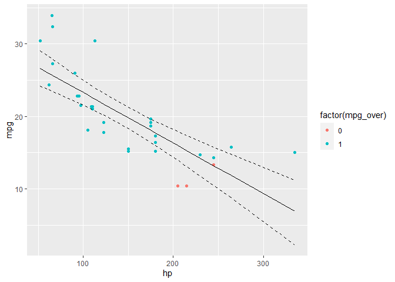<!-- -->

## Censored data - splines    

### Function for splines    

* Based on previous leftcensored_lm function  
* Adapted to splines using this: https://stackoverflow.com/a/35004157/1734247  


```r
leftcensored_splines <- function(data,
                            n.chains = n.chains, # Number of different starting positions
                            n.iter = n.iter, # Number of iterations
                            n.burnin = n.burnin, # Number of iterations to remove at start
                            n.thin = n.thin){
  
  # Censoring vs truncation:
  # https://stats.stackexchange.com/a/144047/13380 
  # Also see here for an alternative way to set up the model:
  # https://stats.stackexchange.com/questions/6870/censoring-truncation-in-jags
  # NOTE: CHECK THIS for multi-level statistical models:
  # https://stats.stackexchange.com/questions/185254/multi-level-bayesian-hierarchical-regression-using-rjags
  
  # Set all censored data to NA (if not already done)
  # Important! Otherwise all LOQ stuff is ignored
  data$y_cens[data$y_aboveLOQ == 0] <- NA
  
  # Jags code to fit the model to the simulated data
  # Jags code to fit the model to the simulated data
  
  model_code = '
model
{
  # Likelihood
  for (i in 1:n) {
    y_aboveLOQ[i] ~ dinterval(y_cens[i], y_LOQ[i])
    y_cens[i] ~ dnorm(y_hat[i], sigma^-2)
    y_hat[i] <- a + beta[1] + beta[2]*x[i] + beta[3]*pow(x[i], 2) + beta[4]*pow(x[i], 3)  
  }

  # Priors

  a ~ dnorm(0, .0001)
  
  # Specify priors for spline terms
  for (k in 1:4) {
    beta.mu[k] ~ dnorm(0, 100)
    beta.tau[k] ~ dgamma(0.01, 10)
    beta[k] ~ dnorm(beta.mu[k], beta.tau[k])
  }
  tau <- pow(sigma, -2)
  sigma ~ dunif(0, 100)

}
'
  ### Set up data and parameters
  # Set up the data
  model_data <- list(n = nrow(data), 
                    y_cens = data$y_cens, 
                    y_aboveLOQ = data$y_aboveLOQ,
                    y_LOQ = data$y_LOQ,
                    x = data$x)
  # Choose the parameters to watch
  model_parameters <-  c("a", "beta", "y_hat", "sigma")
  
  ### Run model
  # Run the model
  model_run <- R2jags::jags(data = model_data,
                   parameters.to.save = model_parameters,
                   model.file=textConnection(model_code),
                   n.chains=4, # Number of different starting positions
                   n.iter = 5000, # Number of iterations
                   n.burnin = 1000, # Number of iterations to remove at start
                   n.thin=2) # Amount of thinning
  
  # model_run
  model_mcmc <- coda::as.mcmc(model_run)
  # summary(model_mcmc) %>% str()
  list(summary = summary(model_mcmc),
       model = model_mcmc)
  
}
```


### mtcars, splines model     


```r
result <- mtcars_cns %>%
  rename(
    x = hp,
    y_cens = mpg_cns,
    y_aboveLOQ = mpg_over,
    y_LOQ = thresh) %>% leftcensored_splines(df_test)
```

```
## Compiling model graph
##    Resolving undeclared variables
##    Allocating nodes
## Graph information:
##    Observed stochastic nodes: 61
##    Unobserved stochastic nodes: 17
##    Total graph size: 284
## 
## Initializing model
```

### mtcars splines, plot  


```r
pred_yhat <- get_estimated_line(result, mtcars_cns$hp)

ggplot(data=mtcars_cns, 
       aes(x=hp, y=mpg)) + 
  geom_point(aes(color = factor(mpg_over))) +
  geom_line(data = pred_yhat, aes(x = x, y = `50%`)) +
  geom_line(data = pred_yhat, aes(x = x, y = `2.5%`), linetype = "dashed") +
  geom_line(data = pred_yhat, aes(x = x, y = `97.5%`), linetype = "dashed")
```

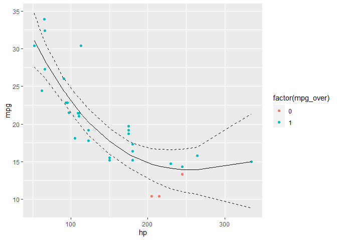<!-- -->

## Censored data - splines, more trials      

### more drastic censoring - data


```r
mtcars_cns <- mtcars %>%
  mutate(
    thresh = case_when(
      hp < 100 ~ 23,
      hp < 240 ~ 17,
      TRUE ~ 12),
    mpg_cns = case_when(
      mpg < thresh ~ thresh,
      TRUE ~ mpg),
    mpg_over = case_when(
      mpg < thresh ~ 0,
      TRUE ~ 1)
  )

table(mtcars_cns$mpg_over)
```

```
## 
##  0  1 
## 10 22
```

```r
#  0  1 
# 10 22 

ggplot(data=mtcars_cns, 
       aes(x=hp, y=mpg_cns, color = factor(mpg_over))) + 
  geom_point()
```

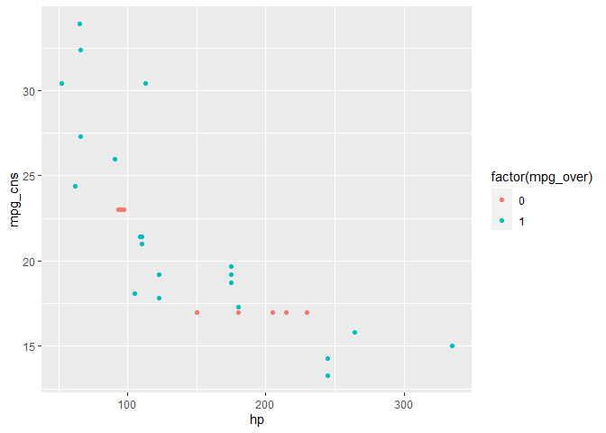<!-- -->

### more drastic censoring - model  

* This works

    - Observed stochastic nodes: 54
    - Unobserved stochastic nodes: 24


```r
result <- mtcars_cns %>%
  rename(
    x = hp,
    y_cens = mpg_cns,
    y_aboveLOQ = mpg_over,
    y_LOQ = thresh) %>%
  leftcensored_splines()
```

```
## Compiling model graph
##    Resolving undeclared variables
##    Allocating nodes
## Graph information:
##    Observed stochastic nodes: 54
##    Unobserved stochastic nodes: 24
##    Total graph size: 284
## 
## Initializing model
```

```r
pred_yhat <- get_estimated_line(result, mtcars_cns$hp)

ggplot(data=mtcars_cns, 
       aes(x=hp, y=mpg)) + 
  geom_point(aes(color = factor(mpg_over))) +
  geom_line(data = pred_yhat, aes(x = x, y = `50%`)) +
  geom_line(data = pred_yhat, aes(x = x, y = `2.5%`), linetype = "dashed") +
  geom_line(data = pred_yhat, aes(x = x, y = `97.5%`), linetype = "dashed")
```

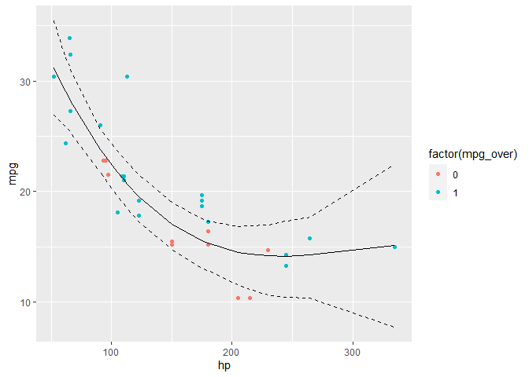<!-- -->

### even more drastic censoring - data  

* This hangs (on 80% when initializing model)  

    - Observed stochastic nodes: 45
    - Unobserved stochastic nodes: 33


```r
mtcars_cns <- mtcars %>%
  mutate(
    thresh = case_when(
      hp < 150 ~ 23,
      hp < 250 ~ 17,
      TRUE ~ 12),
    mpg_cns = case_when(
      mpg < thresh ~ thresh,
      TRUE ~ mpg),
    mpg_over = case_when(
      mpg < thresh ~ 0,
      TRUE ~ 1)
  )

table(mtcars_cns$mpg_over)
```

```
## 
##  0  1 
## 19 13
```

```r
#  0  1 
# 19 13 

ggplot(data=mtcars_cns, 
       aes(x=hp, y=mpg_cns, color = factor(mpg_over))) + 
  geom_point()
```

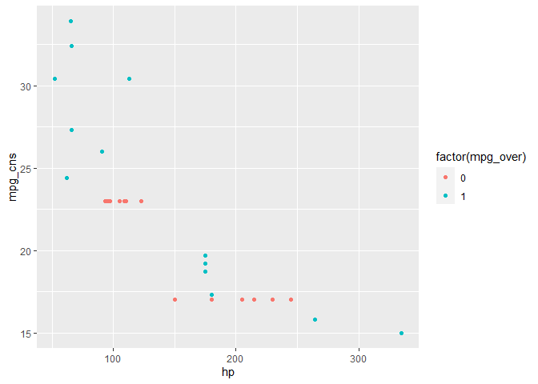<!-- -->

### even more drastic censoring - model


```r
if (FALSE){
  
  # SPLINES - commented out because it fails!
  
  # debugonce(leftcensored_splines)
  result <- mtcars_cns %>%
    rename(
      x = hp,
      y_cens = mpg_cns,
      y_aboveLOQ = mpg_over,
      y_LOQ = thresh) %>%
    leftcensored_splines()
  

}

# LINEAR MODEL - works OK!

result <- mtcars_cns %>%
  rename(
    x = hp,
    y_cens = mpg_cns,
    y_aboveLOQ = mpg_over,
    y_LOQ = thresh) %>%
  leftcensored_lm()
```

```
## Compiling model graph
##    Resolving undeclared variables
##    Allocating nodes
## Graph information:
##    Observed stochastic nodes: 45
##    Unobserved stochastic nodes: 22
##    Total graph size: 183
## 
## Initializing model
```

```r
pred_yhat <- get_estimated_line(result, mtcars_cns$hp)

ggplot(data=mtcars_cns, 
       aes(x=hp, y=mpg)) + 
  geom_point(aes(color = factor(mpg_over))) +
  geom_line(data = pred_yhat, aes(x = x, y = `50%`)) +
  geom_line(data = pred_yhat, aes(x = x, y = `2.5%`), linetype = "dashed") +
  geom_line(data = pred_yhat, aes(x = x, y = `97.5%`), linetype = "dashed")
```

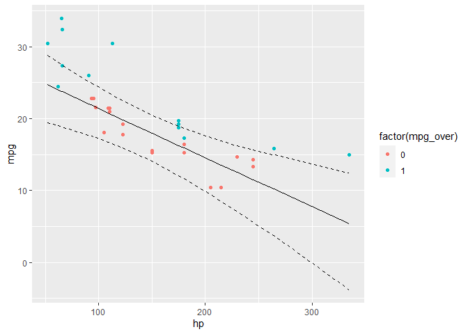<!-- -->


